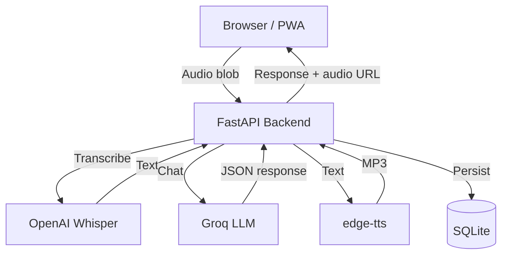

# 🎓 English Tutor AI — Voice-First English Practice with AI

    

An AI-powered English tutor that helps Brazilian Portuguese speakers practice English through voice conversations. Features real-time grammar correction, vocabulary tracking, spaced repetition, and specialized modes for technical interviews, project presentations, and professional meetings.

## Features

- 🎤 **Voice-first** — Hold to talk, instant transcription via OpenAI Whisper
- 🤖 **AI Tutor "Alex"** — Powered by Groq (llama-3.1-70b-versatile), responds with natural English
- ✏️ **Real-time corrections** — Grammar errors corrected gently with Portuguese explanations
- 📚 **Vocabulary tracking** — New expressions saved automatically with spaced repetition review
- 🎯 **4 conversation modes** — Free Talk, Technical Interview, Explain Project, Work Meeting
- 📊 **Progress stats** — Sessions, messages, vocabulary count, streak days, top errors
- 📱 **PWA** — Install on your phone, works like a native app
- 🌙 **Dark mode** — Premium dark theme optimized for mobile

## Architecture



## Tech Stack

| Layer | Technology |
|---|---|
| Backend | FastAPI, Python 3.11, uvicorn |
| LLM | Groq API (llama-3.1-70b-versatile) |
| STT | OpenAI Whisper API |
| TTS | edge-tts (en-US-AriaNeural) |
| Database | SQLite + SQLAlchemy |
| Frontend | React 18, Vite, Tailwind CSS |
| PWA | vite-plugin-pwa, service worker |

## Getting Started

### Prerequisites

- Python 3.11+
- Node.js 18+
- Groq API key ([groq.com](https://groq.com))
- OpenAI API key ([platform.openai.com](https://platform.openai.com))

### Environment Variables

```bash
cp .env.example .env
# Edit .env with your API keys
```

### With Docker (recommended)

```bash
docker-compose up --build
```

Open http://localhost:5173

### Manual Setup

**Backend:**
```bash
cd backend
python -m venv venv
source venv/bin/activate  # Windows: venv\Scripts\activate
pip install -r requirements.txt
cp ../.env.example .env   # add your keys
uvicorn app.main:app --reload --port 8000
```

**Frontend:**
```bash
cd frontend
npm install
npm run dev
```

Open http://localhost:5173

## API Summary

| Method | Endpoint | Description |
|---|---|---|
| POST | `/api/chat/voice` | Send audio, get transcription + AI response + TTS |
| POST | `/api/chat/text` | Send text, get AI response + TTS |
| GET | `/api/chat/history` | Fetch conversation history |
| DELETE | `/api/chat/history` | Clear history (start new session) |
| GET | `/api/vocabulary` | List learned vocabulary |
| GET | `/api/vocabulary/review` | Words due for spaced repetition |
| GET | `/api/progress/stats` | Progress statistics |
| GET | `/api/audio/{filename}` | Stream TTS audio file |

## Project Structure

```
llm-tutor-english/
├── backend/
│   └── app/
│       ├── main.py           # FastAPI entry point
│       ├── config.py         # Settings
│       ├── routers/          # API endpoints
│       ├── services/         # LLM, STT, TTS, Memory
│       ├── models/           # SQLAlchemy ORM
│       ├── schemas/          # Pydantic models
│       └── prompts/          # AI tutor system prompts
└── frontend/
    └── src/
        ├── components/       # UI components
        ├── hooks/            # Audio, chat state hooks
        ├── services/         # API client
        └── utils/            # Audio helpers
```

## Roadmap

- [ ] Pronunciation scoring (compare user audio to native)
- [ ] Shadowing mode (repeat after tutor)
- [ ] Flashcard review for vocabulary
- [ ] Export session transcripts as PDF
- [ ] Offline mode with local TTS

## License

MIT
